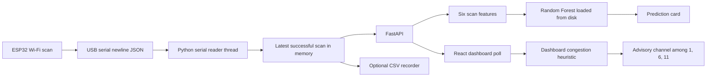

# AETHER-RF Final Technical Audit

**Project:** AI-Powered Wi-Fi Interference Detection and Adaptive Mitigation Platform Using Intelligent Wi-Fi Scanning

**Document type:** Evidence-based technical audit of the repository and of checks that could be run without stopping the live serial process

**Audit date:** 10 October 2026

**Repository:** local working tree at `AETHER-RF`, remote URL `https://github.com/24gigiwike/AETHER-RF.git`

This audit describes the system that is actually in the working tree. It does not treat planned text in older documents as implemented behaviour. Where a development date cannot be recovered from git history, the narrative is labelled as a logical implementation sequence.

---

## 1. How this audit uses evidence

Three kinds of evidence are separated throughout:

1. **Repository evidence.** Source files, schemas, dependency pins, and CSV/model files present on disk.
2. **Checks run for this audit.** Read-only HTTP reads of the already running API, row counts of the existing CSV files, and inspection of `model_metadata.json`. The COM4 process was not stopped or restarted.
3. **Checks run earlier on 10 October 2026 during implementation.** Dataset unit tests, TypeScript check, frontend production build, and a browser pass of the dashboard. Those results are reported as earlier same-day evidence, not as tests repeated for this document.

The serial sketch is archived at `firmware/sketch_oct10b/sketch_oct10b.ino`. It was copied from the local Arduino sketchbook and was not rewritten. It is the only `.ino` found on this computer, and it emits the JSON fields `parse_serial_line` accepts. The ESP32 flash was not read, so the file is archived source rather than a proven dump of the chip. The illustrative HTTP sketch in the dashboard is a different program.

---

## 2. Repository audit

### 2.1 What is implemented

| Area | Implementation | Principal files |
|---|---|---|
| USB serial ingestion | One background thread opens COM4 at 115200 baud, reads newline-delimited JSON, and keeps the latest successful scan | `backend/serial_reader.py` |
| Local API | FastAPI on 127.0.0.1:8000 serves status, observations, channel summaries, and a Random Forest prediction | `backend/main.py` |
| Dashboard, live mode | React polls FastAPI every 4 seconds and maps observations onto the existing scan contract | `src/services/esp32Api.ts`, `src/App.tsx` |
| Dashboard, simulation | A separate simulator and an Express process on port 3000 generate synthetic campus-style scans | `src/services/simulator.ts`, `src/services/wifiDataSource.ts`, `server.ts` |
| Congestion heuristic | Per-channel occupancy, linear-power RSSI, overlap, congestion score, severity, and a recommended channel among 1, 6, and 11 | `src/services/derivedParameters.ts` |
| Dataset recording | Optional append-only CSV of sessions, scans, access points, and channel features | `backend/dataset_recorder.py` |
| Demonstration classifier | Random Forest trained from heuristic labels; loaded once from disk; not retrained on each poll | `backend/congestion_model.py`, `backend/train_model.py` |
| Honest performance placeholders | Packet loss, latency, and throughput are shown as unimplemented and null | `src/components/FuturePerformanceMetrics.tsx` |

### 2.2 What is planned, illustrative, or unused

| Item | Status |
|---|---|
| ESP32 firmware source | Archived copy of `firmware/sketch_oct10b/sketch_oct10b.ino`. It matches the serial JSON contract. It is not a flash read-back. |
| `src/components/Esp32IntegrationModal.tsx` | Contains an **illustrative** Arduino sketch that POSTs JSON to `http://YOUR_SERVER_IP:3000/api/scan/ingest`. That is not the path used by the working serial reader. |
| `docs/ARCHITECTURE.md` | Describes an earlier design: HTTP POST into a REST ingestion API and a “future” scikit-learn classifier. The working hardware path is USB serial into FastAPI, and a demonstration Random Forest now exists. |
| `server.ts` `POST /api/scan/ingest` | Implemented for the Express/Vite process. Its comment calls it the ESP32 production contract. The verified hardware path does not use it. The dashboard’s ESP32 Live mode calls FastAPI, not this route. |
| `@google/genai` and `GEMINI_API_KEY` | Declared in `package.json` and `.env.example`. No import of `@google/genai` was found under `src/`. It is not part of scanning, scoring, or classification. |
| `motion` | Declared in `package.json`. No import was found under `src/`. |
| Packet loss, latency, throughput | Explicitly unimplemented. Values are null. |
| Router control | Not implemented. The hardware rationale text says the recommendation does not control the router. |
| Independently verified interference labels | Not present. Labels are a heuristic. |

### 2.3 Important files and their roles

**Backend**

- `backend/serial_reader.py` — sole COM4 owner, JSON parser, reconnect loop, timestamp assignment, optional recorder hook.
- `backend/main.py` — FastAPI application, CORS for local dashboard origins, response models, freshness rules, prediction endpoint.
- `backend/dataset_recorder.py` — CSV schemas, session UUID and optional labels, channel-feature calculation shared with the model, pseudonymized export.
- `backend/congestion_model.py` — six scan-level features, heuristic risk rule, joblib load-once inference.
- `backend/train_model.py` — reads recordings, writes separate label files, builds the synthetic demonstration set, trains and evaluates.
- `backend/requirements.txt` — pinned Python packages.
- `backend/DATASET.md` — recording controls and schemas.
- `backend/_verify_dataset.py` — local checks for recording, deduplication, legacy session migration, and pseudonym export. It does not open COM4.
- `backend/data/recordings/` — local CSV recordings. Gitignored.
- `backend/data/model/` — trained model, metadata, real heuristic labels, and synthetic rows. Tracked. Recordings under `backend/data/` stay local.

**Frontend**

- `src/App.tsx` — source selector, ESP32 poll loop, simulation loop, layout.
- `src/services/esp32Api.ts` — FastAPI client and mapping onto `RawScanBatch`.
- `src/services/derivedParameters.ts` — dashboard congestion mathematics.
- `src/services/simulator.ts` and `src/services/wifiDataSource.ts` — simulation profiles.
- `src/services/apiClient.ts` — calls the Express simulator endpoints used in simulation mode.
- `src/components/DerivedSummary.tsx` — heuristic severity, worst channel, recommended channel.
- `src/components/ChannelMetricsView.tsx` — Recharts channel chart.
- `src/components/RawObservationTable.tsx` — observed network table.
- `src/components/AiPredictionCard.tsx` — Random Forest class and model status.
- `src/components/ScannerControls.tsx` — ESP32 Live / Simulation selector and link status.
- `src/components/FuturePerformanceMetrics.tsx` — unimplemented performance contract.
- `src/components/Esp32IntegrationModal.tsx` — illustrative HTTP sketch, not flashed firmware.
- `server.ts` — Express plus Vite on port 3000, simulation ingest and trigger routes.
- `package.json` — Node scripts and frontend dependency ranges.

**Git state observed during the audit**

Local commits end at `e2147b9 feat(simulator): expand simulated AP and device pool`. `backend/main.py` and `backend/serial_reader.py` were untracked, and `src/App.tsx` was modified. The serial backend, dataset recorder, and Random Forest therefore exist in the working tree, but they are not in those five local commits. This audit did not fetch or push GitHub, so it does not claim that the remote contains the serial or model work.

---

## 3. Hardware documentation

### 3.1 What the repository can and cannot say

The repository contains the archived serial sketch. It does not contain a board schematic or a USB device descriptor. It cannot, by itself, prove the module name or the USB-serial chip.

The running API, read during this audit without restarting it, reported:

- `esp32Connected: true`
- `comPort: "COM4"`
- `baudRate: 115200`
- `observationState: "fresh"`
- `lastScanId: 1317` on the status read, then scan `1327` on the following observation read
- `detail: "ESP32 connected successfully. Waiting for real Wi-Fi scans."`

COM4 and 115200 are also constants in `backend/serial_reader.py` (`PORT`, `BAUD_RATE`). A CH340 adapter was named in the project implementation brief. **No file in the repository identifies the USB-serial chip.** Device Manager evidence would be required before a thesis states “CH340” as a measured fact.

The illustrative modal names “ESP32 Dev Module (WROOM / WROVER)”. That string is a comment in a sketch that does not match the working serial contract. It is not evidence of the board that is plugged in.

### 3.2 Role of the ESP32

The ESP32 is the radio that performs a Wi-Fi scan and emits one JSON object per scan on the USB serial link. Python does not scan the radio itself. The computer only reads text lines from the serial port.

### 3.3 Serial configuration implemented in Python

| Setting | Value | Source |
|---|---|---|
| Port | COM4 | `serial_reader.py` |
| Baud | 115200 | `serial_reader.py` |
| Read timeout | 1 second | `READ_TIMEOUT_SECONDS` |
| Delay after the port opens | 2 seconds | `POST_OPEN_DELAY_SECONDS` |
| Reconnect wait after an error | 5 seconds | `RECONNECT_INTERVAL_SECONDS` |
| Decode | UTF-8, invalid bytes replaced | `_open_and_read` |
| Framing | One JSON object per newline | `readline` then `parse_serial_line` |

Opening the port is done with PySerial: `serial.Serial(port="COM4", baudrate=115200, timeout=1)`. The reader thread is named `esp32-serial-reader`. `start()` returns immediately if that thread is already alive, so HTTP requests do not open the port again.

### 3.4 Scanning sequence, as far as the repository can describe it

Firmware startup steps are **not** in the repository. The sequence that is implemented and observed is:

1. The FastAPI process starts and its lifespan calls `get_reader().start()`.
2. The reader thread logs `Connecting to ESP32 on COM4...` and opens the port.
3. It marks the link connected and waits 2 seconds before reading.
4. It reads lines until the port errors or the process stops.
5. A line is classified as malformed, failed, or successful.
6. Only a successful line replaces the stored scan. The timestamp is assigned in Python at receipt: `datetime.now(timezone.utc).isoformat()`. The ESP32 timestamp, if any, is not part of the stored contract.
7. If recording is enabled, that scan is appended once. Polling does not write a row.
8. FastAPI endpoints return a snapshot of that stored scan.
9. If the port drops, the thread waits 5 seconds and tries again. The last successful scan is kept. The API then reports the scan as stale or the link as disconnected. No substitute measurements are created.

### 3.5 What a successful serial object must contain

`parse_serial_line` requires:

- a JSON object
- `networks` as a list, which may be empty
- `scanSuccess` exactly equal to `true`

`scanSuccess: false`, or a missing flag, is a failed scan and does not replace the last success. Non-JSON text is ignored.

Each network entry must have:

- `rssi` as an integer from −120 to 0
- `channel` as an integer from 1 to 14
- a non-empty `bssid`, stored uppercased
- `ssid` as a string, or empty if missing or null
- a security field under one of `securityType`, `security`, `authMode`, `encryption`, or `auth`

Known names such as `WPA2_PSK` are kept. Integer ESP-IDF authentication-mode numbers are mapped where the table has them. A compact unknown token such as `SECURED` is preserved rather than rewritten as `UNKNOWN`.

### 3.6 What the radio measurement is, and what software calculates

**Taken from the scan report, via the serial JSON**

- SSID string, which may be empty for a hidden network
- BSSID
- RSSI in dBm, as an integer
- Wi-Fi channel number
- security type string
- scan identifier
- the fact that the scan completed (`scanSuccess`)
- the network list, including a successful scan that saw zero networks

**Calculated later, not measured by the ESP32 in this design**

- receipt timestamp
- linear-power mean RSSI
- strongest RSSI within a channel
- channel occupancy counts
- spectral-overlap weights
- dashboard congestion score and severity
- recommended channel
- Random Forest class
- heuristic risk used only as a demonstration label

**Not measured anywhere in the working system**

- packet loss
- throughput
- round-trip latency
- spectrum-analyser power
- a calibrated interference power in dBm
- a ground-truth interference label

The ESP32 RSSI is a received-signal-strength indication reported by the Wi-Fi scan, in dBm. It is not a measurement of interference power on an empty channel.

### 3.7 Observed live scan during this audit

`GET /api/observations` returned scan `1327` at `2026-10-10T20:03:50.819652+00:00` with one network:

| Field | Value |
|---|---|
| SSID | Chibuzor |
| BSSID | D8:42:F7:19:1B:0A |
| RSSI | −86 dBm |
| Channel | 10 |
| Security | SECURED |

`GET /api/channels` returned 13 channels. Channel 10 had count 1, average RSSI −86.0, strongest RSSI −86. Empty channels had count 0 and null RSSI. `GET /api/prediction` returned class LOW for the same scan id and timestamp.

These identifiers can identify a place or a device. The raw CSV files are local and gitignored.

### 3.8 Physical limitations

- One process may own COM4. A second reader, or the Arduino Serial Monitor, causes a serial open failure. The reader then retries.
- The port, baud, and adapter chip are fixed in code or in the Windows port assignment. They are not discovered dynamically.
- The reader accepts 2.4 GHz channel numbers 1–14 only. It does not ingest 5 GHz or 6 GHz scans.
- RSSI is whatever the firmware’s scan API reports. The repository contains no calibration against a spectrum analyser.
- A successful empty scan is valid. A failed scan is discarded.
- Scan duration is not provided on the serial contract used by the reader. The dashboard stores `scanDurationMs` as null for hardware and displays that duration as not available.
- Unplugging the USB cable was not repeated as a hardware test. The code path for a serial error exists; the unplug behaviour on this machine was not observed in the recorded tests.

---

## 4. Software technologies

Versions below are taken from `backend/requirements.txt`, `package.json`, the Python interpreter, the Node binary, or the Vite build log from 10 October 2026. A declared range is not written as if it were a more precise installed build unless that build was observed.

| Technology | Version evidence | Purpose | Where used | Why it fitted the prototype |
|---|---|---|---|---|
| Python | 3.14.8, reported by the backend virtual environment | Serial ingestion, API, recording, training | `backend/` | One language can own the serial port, the API, and the model |
| PySerial | 3.5, pinned | Open COM4 and read lines | `serial_reader.py` | Standard library-style access to a USB serial port on Windows |
| FastAPI | 0.143.0, pinned | HTTP API and response models | `main.py` | Small local API with typed JSON responses |
| Uvicorn | 0.54.0, pinned | ASGI server | process command `uvicorn main:app --host 127.0.0.1 --port 8000` | Runs one process without reload, so one thread keeps COM4 |
| scikit-learn | 1.7.2, pinned | Random Forest and metrics | `train_model.py` | A small classical classifier with a fixed seed |
| pandas | 2.3.3, pinned | Tabular train/test split frame | `train_model.py`, inference frame in `congestion_model.py` | Keeps feature names aligned between fit and predict |
| joblib | 1.5.2, pinned | Save and load the forest | `train_model.py`, `congestion_model.py` | Usual persistence format for a scikit-learn estimator |
| Random Forest | `RandomForestClassifier`, 80 trees, `max_depth=6`, `random_state=42`, `class_weight="balanced"` | Three-class demonstration | `train_model.py` | Explainable ensemble; no GPU; trains on a few hundred rows |
| Node.js | v24.16.0, reported by `node -v` | Dashboard tooling | repository root | Required to run TypeScript, Vite, and the Express dev server |
| React | ^19.0.1 in `package.json` | Dashboard UI | `src/` | The interface already existed and was reused |
| TypeScript | ~5.8.2 in `package.json` | Typed frontend | `src/`, `tsc --noEmit` | Checks the data contract without a redesign |
| Vite | ^6.2.3 declared; build log reported Vite 6.4.4 | Frontend bundling, used through the Express dev server | `vite.config.ts`, `server.ts` | Already the project’s bundler |
| Express | ^4.21.2 | Dev server and simulation routes on port 3000 | `server.ts` | Already served the simulator |
| Tailwind CSS | ^4.1.14, with `@tailwindcss/vite` ^4.1.14 | Utility styling | frontend components | Already the project’s styling method |
| Recharts | ^3.10.1 | Channel bar chart | `ChannelMetricsView.tsx` | Already used for the congestion chart |
| lucide-react | ^0.546.0 | Icons | dashboard components | Already used |
| esbuild | ^0.25.0 | Bundle `server.ts` for production | `package.json` build script | Already the server bundler |
| tsx | ^4.21.0 | Run `server.ts` in development | `npm run dev` | Already the dev command |
| CSV | Python `csv` module | Recordings and label files | `dataset_recorder.py`, `train_model.py` | Append-only local files, no database |
| JSON | serial payload and HTTP bodies | Scan transport and API | reader, FastAPI, React `fetch` | Matches both the serial line and the dashboard |
| Git | local history present | Version control | repository | Five local commits document the earlier simulator platform |
| GitHub | remote `https://github.com/24gigiwike/AETHER-RF.git` | Host named by `git remote` | local git config | The remote exists. This audit did not verify that the serial/ML tree has been pushed |

**Not a verified installed technology**

- Arduino IDE and the ESP32 Arduino core are not recorded in the repository. The modal sketch mentions `WiFi.h` and `ArduinoJson.h`, but that sketch is illustrative.
- No database, Firebase, Docker, or cloud training service is used by the working pipeline.
- `@google/genai` is declared and unused by the scanning code.

---

## 5. System architecture

### 5.1 Simplified path



### 5.2 What that diagram must not hide

The dashboard does **not** display the FastAPI channel list as its congestion chart. It downloads observations and runs `processRawObservations` in the browser. The prediction endpoint separately rebuilds channel features with `channel_feature_rows` and classifies them. Those two calculations are related but not identical. Section 8 gives both formulas.

Recording, when enabled, happens inside the serial reader when a new successful scan is stored. It does not happen inside the HTTP handlers. A poll of the same scan does not add a CSV row.

Simulation does not enter this path. `src/App.tsx` keeps a separate snapshot. In simulation the prediction card states that the forest is not applied.

```text
ESP32 scan report
  -> USB serial, COM4, 115200, one JSON line
    -> esp32-serial-reader
       -> parse_serial_line
       -> UTC timestamp assigned in Python
       -> in-memory latest scan
          -> optional ScanRecorder append
          -> GET /api/status
          -> GET /api/observations
          -> GET /api/channels          (count, linear mean, strongest)
          -> GET /api/prediction
               -> channel_feature_rows
               -> six scan features
               -> joblib forest
React every 4 s
  -> observations mapped to RawScanBatch
  -> processRawObservations
       -> congestion score, severity, recommended channel
  -> AiPredictionCard shows the forest class
Simulation
  -> server.ts and local simulator only
  -> same processRawObservations
  -> forest not applied
```

There is one serial reader per API process. Uvicorn is started without `--reload`. On Windows the server process has a parent Python process; only the child listens on port 8000 and opens COM4.

---

## 6. Development narrative

Git proves an earlier simulator platform: initial commit, live scanner refactor, FUTO campus simulation profiles, and an expanded simulated device pool. The serial API, CSV recorder, and Random Forest are in the working tree and are not in those commits. The phases below are the logical build order of the code that is present. They are not a verified diary except where a file or a same-day test is cited.

### Phase 1 — Problem, objectives, and scope

The problem stated by the project title and by `docs/ARCHITECTURE.md` is 2.4 GHz Wi-Fi congestion: many access points share overlapping channels, and a scan can show where energy and occupancy are concentrated.

The implemented objectives are narrower than a full adaptive network controller:

- read real scan reports from an ESP32
- show SSID, BSSID, RSSI, channel, and security
- compute a transparent congestion heuristic and recommend one of channels 1, 6, or 11
- record scans locally for later study
- demonstrate a Random Forest that imitates a documented label rule
- keep simulation available and separate
- leave packet loss, latency, throughput, and router control unimplemented rather than fake them

### Phase 2 — ESP32 configuration

The archived sketch is `firmware/sketch_oct10b/sketch_oct10b.ino`. Board setup and a flash read-back are not in the repository. A device on COM4 emits newline JSON which the reader accepts, and a live scan carried `securityType: "SECURED"`. The modal’s HTTP POST sketch would not satisfy `parse_serial_line`, because that parser requires `scanSuccess` and `networks`, and it never listens for an HTTP body.

### Phase 3 — Python integration

The backend virtual environment is Python 3.14.8. PySerial 3.5 reads COM4. Malformed lines are skipped. A failed scan does not erase the last success. The timestamp is the UTC time the line was accepted, not a clock inside the JSON.

### Phase 4 — FastAPI

`main.py` binds the service to localhost, allows the dashboard origins on ports 3000 and 5173, and starts the reader in the application lifespan. Freshness is 30 seconds and requires the serial link to be up. Older scans, or any scan while the link is down, are stale. Empty channels are count 0 and null RSSI, not a fabricated −100 in the channel API. The browser heuristic still uses −100 internally when a channel has no access points.

### Phase 5 — React dashboard

The existing layout was kept: header, scanner controls, summary cards, Recharts channel view, observation table, and the unimplemented performance panel. ESP32 Live polls `/api/status`, `/api/observations`, `/api/channels`, and `/api/prediction` together every 4000 ms, with one in-flight poll. Simulation uses the existing scanner and is not substituted while ESP32 Live is selected and the API fails. The last good hardware scan stays on screen when the API becomes unreachable.

### Phase 6 — Dataset collection

Recording is off unless `AETHER_RECORD_SCANS` is `1`, `true`, `yes`, or `on` at process start. Each enabled process creates a UUID `session_id`. Optional labels are `AETHER_SESSION_NAME`, `AETHER_SESSION_ENVIRONMENT`, `AETHER_SESSION_SCENARIO`, and `AETHER_SESSION_NOTES`. The UUID remains the link across files. The name does not replace it.

On disk during this audit:

| File | Rows | Role |
|---|---|---|
| `sessions.csv` | 2 | Session UUID, start time, optional labels |
| `scans.csv` | 12 | One row per successful scan, all in the first session |
| `access_points.csv` | 22 | One row per observed access point |
| `channel_features.csv` | 156 | 13 channels × 12 scans |

The second session, `home_baseline_01`, has metadata and **zero** scan rows. Features do not include a congestion score or a ground-truth label.

### Phase 7 — Machine learning

Twelve real scans were labelled LOW by the rule in `congestion_model.py`. That set cannot train a three-class model. `train_model.py` therefore builds 144 synthetic feature rows, 48 per class, marked `synthetic_demonstration`. The forest is fit on 70 percent of those rows plus the 12 real LOW rows (112 training rows) and scored on the synthetic holdout. The model file is `backend/data/model/random_forest.joblib`. Inference loads it once.

### Phase 8 — Advisory mitigation

`processRawObservations` scores channels 1–13 and chooses the lowest score among channels 1, 6, and 11. Nothing in the API or dashboard sends that choice to a router. The on-screen rationale says so.

### Phase 9 — Testing

Section 11 lists what was run, what was only inspected, and what was not tested.

---

## 7. Mathematical and algorithmic explanation

Two different heuristics exist. The dashboard severity is not the Random Forest label.

### 7.1 RSSI

RSSI is the integer dBm value in the scan report. A value closer to zero is stronger: −40 dBm is stronger than −90 dBm. The reader rejects values outside −120 to 0.

The reader does not convert RSSI. Later averages do, because an arithmetic mean of decibels is not a mean of power.

### 7.2 Access-point count

For a channel, the count is the number of accepted networks whose channel number equals that channel.

`ap_count(c) = |{ networks with channel = c }|`

The scan total used by the model is the sum of those counts over channels 1–13. Channel 14 can be stored in the access-point CSV if the reader accepted it, but the feature grid and the dashboard buckets are channels 1–13.

### 7.3 Channel occupancy

In the feature file, occupancy of a channel is `ap_count`. At scan level the model uses:

- `occupied_channel_count`: how many of channels 1–13 have `ap_count > 0`
- `max_channel_ap_count`: the largest `ap_count`

### 7.4 Linear-power mean RSSI

Implemented in `dataset_recorder.linear_power_mean_dbm` and, in the browser, `calculateAverageRssi`.

For readings `r_1 ... r_n` in dBm:

`P_i = 10^(r_i / 10)`  (milliwatts if the dBm reference is 1 mW)

`mean_dBm = 10 * log10( (P_1 + ... + P_n) / n )`

The result is rounded to one decimal place. If there are no readings, the Python helper returns null. The channel API then sends null. The browser function returns −100 for an empty list so that later score code has a number. The model uses −100 only when a scan has no usable RSSI (`MISSING_RSSI_DBM`).

**Example.** Readings −40 dBm and −50 dBm.

`P = 10^(-4) = 0.0001` and `10^(-5) = 0.00001`

`mean power = 0.000055`

`mean_dBm = 10 * log10(0.000055) = -42.6` after one-decimal rounding.

The arithmetic mean would have been −45 dBm. The implementation does not use that.

The scan-level model mean recomputes the same quantity from per-channel means by weighting each channel mean by its access-point count, again in linear power. That matches a mean over the individual access points when every access point on a channel was included in that channel’s mean.

### 7.5 Strongest RSSI

`strongest(c) = max(r on channel c)`

For the scan, the model takes the maximum of the per-channel strongest values. There is no weighting. −40 is selected over −80 because it is the numeric maximum.

### 7.6 Overlap weights

`getSpectralOverlapFactor` in `derivedParameters.ts` and `spectral_overlap` in `dataset_recorder.py` use the same table. Channel 14 overlaps only itself.

| Absolute channel difference | Weight |
|---|---|
| 0 | 1.00 |
| 1 | 0.82 |
| 2 | 0.58 |
| 3 | 0.32 |
| 4 | 0.12 |
| 5 or more | 0 |

These numbers are a fixed mask in code. They are not a measurement from this project’s hardware.

For the CSV feature of channel `c`:

`adjacent_ap_count(c) = sum of ap_count(o) over other channels o with weight(c, o) > 0`

`overlap_weighted_ap_count(c) = sum of ap_count(o) * weight(c, o)` over those other channels

**Example.** One access point on channel 6. Channel 7 has difference 1, so its overlap feature is `1 * 0.82 = 0.82`. Channel 6’s own overlap feature is 0, because the sum skips the channel itself. Channel 1 has difference 5, so its overlap feature is 0.

The model keeps only the maximum of `overlap_weighted_ap_count` across channels 1–13.

### 7.7 Dashboard congestion score

This is a heuristic in `processRawObservations`. It is not the Random Forest.

For each channel, with `n = ap_count` and `avg` the linear-power mean, or −100 if empty:

`normalized = 0` if `n = 0`, otherwise clamp `(avg - (-100)) / (-30 - (-100))` into the span from −100 dBm to −30 dBm

`density = min(1, n / 6)`

`coChannel = min(1, 0.5 * density + 0.5 * normalized)`

`adjacentBleed = sum over other channels of coChannel(other) * overlap(c, other) * 0.45`

`aci = min(1, adjacentBleed)`

`congestion = min(1, 0.70 * coChannel + 0.30 * aci)`

Scores are rounded to two decimal places.

The overall index is:

`overall = min(1, round( (sum of the 13 congestion scores / 13) * 1.8 , 2) )`

Severity uses the highest per-channel score `h` and the number of observations `N`:

| Class | Condition |
|---|---|
| HIGH | `h >= 0.75` or `N >= 18` |
| MEDIUM | else `h >= 0.50` or `N >= 10` |
| LOW | else `h >= 0.25` or `N >= 4` |
| NORMAL | otherwise |

**Example.** One access point on channel 6 at −80 dBm. `normalized = 20/70 ≈ 0.286`. `density = 1/6 ≈ 0.167`. `coChannel ≈ 0.23`. Every other channel has co-channel score 0, so ACI is 0. `congestion ≈ 0.16`. With `N = 1` and `h < 0.25`, severity is NORMAL. This is a heuristic threshold, not a standards-body interference class.

### 7.8 Random Forest label rule

Separate heuristic in `heuristic_label`. It does not use the dashboard score.

`density = min(total_ap_count / 10, 1)`

`occupancy = min(occupied_channel_count / 8, 1)`

`strength = 0` if there are no access points, otherwise clamp `(strongest_rssi_dbm - (-100)) / 70` to 0..1

`overlapTerm = clamp(max_overlap_weighted_ap_count / 4, 0, 1)`

`risk = 0.45 * density + 0.20 * occupancy + 0.20 * strength + 0.15 * overlapTerm`

| Label | Condition |
|---|---|
| LOW | `risk < 0.35` |
| MEDIUM | `0.35 <= risk < 0.62` |
| HIGH | `risk >= 0.62` |

**Example.** One access point, strongest RSSI −86 dBm, one occupied channel, max overlap 0.82.

`density = 0.10`

`occupancy = 0.125`

`strength = 14/70 = 0.20`

`overlapTerm = 0.82/4 = 0.205`

`risk = 0.045 + 0.025 + 0.040 + 0.03075 = 0.141`

The label is LOW. The live prediction for scan 1327, which had one access point at −86 dBm, was LOW. That agreement is with this rule’s region, not a proof of measured interference.

### 7.9 Random Forest classification

The classifier is an ensemble of 80 decision trees. Each tree votes for LOW, MEDIUM, or HIGH. The predicted class is the majority vote (`predict`, not a hand-written probability threshold). `class_weight="balanced"` reweights classes during fitting. `random_state=42` fixes the draw. `max_depth=6` limits each tree.

The six inputs, in order, are:

1. `total_ap_count`
2. `occupied_channel_count`
3. `max_channel_ap_count`
4. `mean_rssi_dbm`
5. `strongest_rssi_dbm`
6. `max_overlap_weighted_ap_count`

Inference builds a one-row pandas frame with those names so the column names match training. The model file is rejected if its stored feature tuple differs.

### 7.10 Channel recommendation

Among channels 1, 6, and 11, the dashboard selects the smallest `congestion` score. Ties keep the earlier channel in that list, so channel 1 wins a tie with 6 or 11, and channel 6 wins a tie with 11. The worst channel is the maximum score over channels 1–13, with the same first-maximum tie behaviour.

The recommendation is advisory text. No code path changes an access point’s channel.

---

## 8. Machine-learning documentation

### 8.1 Confirmed figures

Read from `backend/data/model/model_metadata.json`, `real_heuristic_labels.csv`, and `synthetic_demonstration.csv` during this audit:

| Fact | Value |
|---|---|
| Real recorded scans used as examples | 12 |
| Real sessions that contain scans | 1 |
| Heuristic labels of those 12 | LOW: 12 |
| Synthetic rows | 144 |
| Synthetic class counts | LOW 48, MEDIUM 48, HIGH 48 |
| Synthetic origin field | `synthetic_demonstration` on every row |
| Training rows | 112 |
| Holdout support | LOW 15, MEDIUM 15, HIGH 14 |
| Holdout accuracy | 1.00 |
| Per-class precision, recall, and F1 on that holdout | 1.00 for each class |
| Confusion matrix, rows and columns LOW, MEDIUM, HIGH | `[[15,0,0],[0,15,0],[0,0,14]]` |
| `labelsAreMeasuredInterference` | false |
| `reliableInterferenceEvaluation` | false |

The 1.00 score measures agreement with labels generated from the same style of features by `heuristic_label`. It is not an accuracy for real-world interference detection. The synthetic rows were drawn until the rule assigned the requested class, so the three clouds are separated by construction. A forest can memorise that separation.

### 8.2 Preprocessing

Real rows come from `channel_features.csv`, grouped by session id, scan id, and timestamp, then passed through `scan_features_from_channel_rows`. Live inference uses `channel_feature_rows` on the in-memory networks and the same aggregation. Blank RSSI cells stay blank in the CSV. The model number for “no RSSI” is −100 dBm, and signal strength in the label rule is then zero.

No SSID or BSSID is a model input.

### 8.3 Synthetic construction

`train_model.py` uses `random.Random(42)`. It invents access-point lists in memory, runs them through the same `scan_features_from_networks` function used at inference, and keeps a row only when `heuristic_label` returns the target class. It stops at 48 kept rows per class. Discarded draws are not relabelled. The saved synthetic file stores features, scenario name, risk, and label. It does not store the invented BSSIDs and does not claim an ESP32 capture.

The generators aim at different regions: few weak access points for LOW, a mid-sized set for MEDIUM, and a larger clustered set for HIGH. The label function, not the scenario name, decides the class.

### 8.4 Training and persistence

`train_test_split(..., test_size=0.30, random_state=42, stratify=heuristic_label)` splits the 144 synthetic rows. The 12 real LOW rows are added only to the training side. The estimator is then `joblib.dump`’d with the feature names. Metadata is written beside it. Training refuses to finish if the recording files change byte-for-byte during the run.

### 8.5 Inference

`load_model` runs on the first prediction in the process and then returns the cached object. A missing or incompatible file yields `modelStatus: "model_missing"` and no class. A scan that is not fresh yields `no_fresh_scan` or `stale_scan` and no class. The endpoint does not call `train_model.py`.

### 8.6 Limitations

- One real environment, one scan session, one heuristic class.
- No session-separated test of interference detection is possible.
- The holdout is synthetic and label-consistent by construction.
- The dashboard severity and the forest class can disagree, because their formulas differ. Section 7.7 and 7.8 show a one-access-point case in which dashboard severity is NORMAL and the label rule is LOW.
- The forest is a demonstration model. The UI says so.

---

## 9. API and data-flow documentation

Base URL used by the dashboard: `VITE_API_BASE_URL`, default `http://127.0.0.1:8000`.

Poll interval: 4000 ms. One poll at a time. Prediction is fetched in that same poll. If the prediction request fails, observations can still return; the card then shows the prediction API as unavailable.

Freshness: `FRESH_WINDOW_SECONDS = 30`. State is `fresh` only when the serial link is connected and the last success is at most 30 seconds old. Otherwise a stored scan is `stale`. No stored scan is `waiting`.

### 9.1 `GET /api/status`

**Purpose.** Link and freshness, without the network list.

**Source.** Reader snapshot.

**Fields.** `esp32Connected`, `comPort`, `baudRate`, `lastSuccessfulScanTimestamp`, `lastScanId`, `dataSource` (`esp32`), `observationState`, `observationsFresh`, `freshWindowSeconds`, `detail`.

**Example observed during this audit.**

```json
{
  "esp32Connected": true,
  "comPort": "COM4",
  "baudRate": 115200,
  "lastSuccessfulScanTimestamp": "2026-10-10T20:02:46.596901+00:00",
  "lastScanId": 1317,
  "dataSource": "esp32",
  "observationState": "fresh",
  "observationsFresh": true,
  "freshWindowSeconds": 30,
  "detail": "ESP32 connected successfully. Waiting for real Wi-Fi scans."
}
```

The next read had already moved to scan 1327. Scan ids increase as new successful lines arrive. The id is taken from the JSON `scanId` field.

### 9.2 `GET /api/observations`

**Purpose.** Latest successful scan, or an explicit waiting payload if none has arrived.

**Source.** The in-memory scan. Not the CSV file. Not the simulator.

**Fields.** `status` (`ok` or `waiting`), `observationState`, `dataSource`, `message`, `scanId`, `timestamp`, `networkCount`, `networks[]` of `ssid`, `bssid`, `rssi`, `channel`, `securityType`.

**Example observed during this audit.**

```json
{
  "status": "ok",
  "observationState": "fresh",
  "dataSource": "esp32",
  "scanId": 1327,
  "timestamp": "2026-10-10T20:03:50.819652+00:00",
  "networkCount": 1,
  "networks": [
    {
      "ssid": "Chibuzor",
      "bssid": "D8:42:F7:19:1B:0A",
      "rssi": -86,
      "channel": 10,
      "securityType": "SECURED"
    }
  ]
}
```

`waiting` is returned when no successful scan has been stored. The message says the values are not simulated. A stale scan is still `status: "ok"` with `observationState: "stale"` and a message that the link is down or the scan is older than 30 seconds.

### 9.3 `GET /api/channels`

**Purpose.** Thirteen channel rows: count, linear-power average, strongest RSSI.

**Source.** The same in-memory networks. Empty channels are not filled with −100 in this payload.

**Fields.** `status`, `observationState`, `dataSource`, `message`, `scanId`, `timestamp`, `averageRssiMethod` (`linear_power`), `channels[]` of `channel`, `accessPointCount`, `averageRssi`, `strongestRssi`.

**Example fragment for scan 1327.** Channel 1: count 0, average null, strongest null. Channel 10: count 1, average −86.0, strongest −86. Thirteen rows were returned.

This endpoint does not include overlap, congestion, or a recommendation. The dashboard chart does not use it for those quantities.

### 9.4 `GET /api/prediction`

**Purpose.** Class for the latest fresh scan, or a clear unavailable state.

**Source.** In-memory networks, features from `scan_features_from_networks`, estimator from `random_forest.joblib`.

**Fields.** `status` (`ok` or `unavailable`), `scanId`, `timestamp`, `predictedClass` (`LOW`, `MEDIUM`, `HIGH`, or null), `modelName` (`Random Forest`), `predictionSource` (`heuristic-trained demonstration model`), `modelStatus`.

**Example observed during this audit.**

```json
{
  "status": "ok",
  "scanId": 1327,
  "timestamp": "2026-10-10T20:03:50.819652+00:00",
  "predictedClass": "LOW",
  "modelName": "Random Forest",
  "predictionSource": "heuristic-trained demonstration model",
  "modelStatus": "ready"
}
```

`modelStatus` values implemented in `build_prediction`: `ready`, `model_missing`, `no_fresh_scan`, `stale_scan`, `prediction_failed`. No class is returned in the unavailable cases.

### 9.5 Express routes, simulation only

On port 3000, `server.ts` also exposes `/api/health`, `/api/scan/latest`, `/api/scan/history`, `POST /api/scan/ingest`, and `POST /api/simulator/trigger`. ESP32 Live does not use these for its measurements. Simulation does. Treating `/api/scan/ingest` as the live hardware contract would contradict `esp32Api.ts`.

### 9.6 Failures and reconnection

- Serial exception: link marked disconnected, last scan retained, retry after 5 seconds.
- API process down: the browser poll fails, link state becomes unavailable, and the last hardware scan stays on screen. Simulation is not inserted.
- Prediction failure alone: the card shows an unavailable model status; the observation mapping can still succeed.
- Duplicate recording key: `(scan_id, received_at_utc)` already in `scans.csv` is skipped.
- Recording disabled: the recorder is not attached, and CSV files are not opened for append.

---

## 10. Dataset schemas

| File | Columns |
|---|---|
| `sessions.csv` | `session_id`, `started_at_utc`, `session_name`, `session_environment`, `session_scenario`, `session_notes` |
| `scans.csv` | `session_id`, `scan_id`, `received_at_utc`, `network_count`, `scan_success` |
| `access_points.csv` | `session_id`, `scan_id`, `received_at_utc`, `ssid`, `bssid`, `rssi`, `channel`, `security_type` |
| `channel_features.csv` | `session_id`, `scan_id`, `received_at_utc`, `channel`, `ap_count`, `mean_rssi_dbm`, `strongest_rssi_dbm`, `adjacent_ap_count`, `overlap_weighted_ap_count` |

A successful scan with zero access points is a scan row and thirteen feature rows with blank RSSI. It has no access-point rows. An older two-column `sessions.csv` is rewritten once to add empty metadata cells; scan files are not rewritten. `python dataset_recorder.py export --pseudonymize` writes a separate copy. The salt stays in the recordings directory.

---

## 11. Testing and results

| Test | Objective | Method | Expected | Observed | Result | Evidence |
|---|---|---|---|---|---|---|
| ESP32 link | Confirm the running reader sees the board | `GET /api/status` during this audit, process left running | `esp32Connected` true, COM4, 115200 | Fresh scan, scan id 1317 at the status read | Pass | This audit |
| Live observations | Confirm a real network list | `GET /api/observations` | HTTP 200 and a network array | Scan 1327, one network, RSSI −86, channel 10, security SECURED | Pass | This audit |
| Channel summary | Confirm 13 channels and null empty RSSI | `GET /api/channels` | 13 rows, `linear_power` | Channel 10 matched the observation; channel 1 was empty and null | Pass | This audit |
| Prediction | Confirm a class without retraining | `GET /api/prediction` | `ready` and a class, same scan id | LOW for scan 1327 | Pass | This audit |
| JSON parser and zero-network scans | Reject bad lines and keep an empty success | `backend/_verify_dataset.py` reader hook | One recorded success, failed and non-JSON ignored | Reported pass earlier on 10 October 2026 | Pass, earlier | Test script output that day |
| Recording deduplication and disabled mode | One row per scan; disabled mode writes nothing | Same script, temporary directories | No duplicate keys; disabled directory absent | Reported pass earlier that day | Pass, earlier | Test script output |
| Legacy session migration | Old session rows kept | Same script on a fixture, not on a destructive edit of the live file | Old id and timestamp kept; live files byte-identical at end of test | Reported pass earlier that day | Pass, earlier | Test script output |
| Linear-power mean | Feature mean matches the helper | Same script | Channel-6 mean equals `linear_power_mean_dbm` | Reported pass earlier that day | Pass, earlier | Test script output |
| Live recording versus API | CSV matches one hardware scan and polls do not duplicate it | Hardware session earlier on 10 October 2026 | Same timestamp and BSSID; unique keys | 12 scans stored once; scan 891 matched the API; later polls with recording off did not append | Pass, earlier | Implementation record and the 12-row file still present |
| TypeScript | Dashboard types compile | `tsc --noEmit` | Exit 0 | Exit 0 earlier that day | Pass, earlier | Tool result |
| Frontend build | Production bundle builds | `npm run build` | Exit 0 | Exit 0; Vite reported 6.4.4. Chunk-size warning only | Pass, earlier | Build log |
| Dashboard live and simulation | Card, heuristic, and source isolation | Browser pass earlier that day | LOW card on hardware; simulation shows simulator SSIDs and does not apply the forest | Observed as specified | Pass, earlier | Browser check that day |
| USB unplug | Disconnected state when the cable is removed | Not run | Link becomes disconnected without invented scans | Not observed | Not tested | No hardware-unplug log |
| Second physical environment | MEDIUM or HIGH from a real place | Not available | More than one real class | All 12 real labels are LOW | Not available | CSV and metadata |
| Firmware unit test | Sketch behaviour | Archived sketch, not executed in a harness | — | — | Not tested | Sketch copied; flash not read |

The dataset script opens a reader with port name `COM_UNUSED` and feeds strings to `_handle_line`. It does not open COM4. This audit did not start a second reader.

---

## 12. Demonstration readiness

The system can be demonstrated today if one API process is started, the board is on COM4, and the dashboard is opened in ESP32 Live. During this audit the link was fresh and the prediction card’s data source returned LOW.

### 12.1 Critical

None found that stop a demonstration while the current process is healthy. A second program opening COM4, or stopping the API, would stop the live demo. That is an operating constraint, not a code defect observed in the audit.

### 12.2 Important before a defense

1. **Two incompatible ESP32 stories are visible.** `docs/ARCHITECTURE.md`, `server.ts`, and `Esp32IntegrationModal.tsx` still describe HTTP POST ingestion. The working system is USB serial JSON into FastAPI. A reviewer who follows the modal can flash the wrong sketch. The thesis must follow the serial reader, and the modal should be described as obsolete illustrative text.
2. **Firmware is not archived.** The thesis cannot quote the flashed program. The serial contract in `parse_serial_line` is the best specification of what the board must send.
3. **The forest must not be described as validated interference detection.** Twelve real scans, one session, all LOW. The 1.00 score is synthetic agreement with a heuristic.
4. **Dashboard severity and the forest are different heuristics.** Saying “the AI congestion score” for the card in `DerivedSummary.tsx` would mix them. That card is the browser heuristic. The forest is `AiPredictionCard`.
5. **`home_baseline_01` recorded no scans.** A named session row exists with zero scan rows. A defense dataset claim should not treat that name as a completed capture.
6. **USB disconnect was not tested on the bench.** The code keeps the last scan and retries. The on-screen disconnected state after an unplug was not observed.
7. **Identifiers.** SSIDs and BSSIDs in the CSV and in this audit’s example are identifying. Raw recordings should stay local. The pseudonym export exists for a shareable copy.

### 12.3 Optional

- Packet-loss, latency, and throughput cards are correctly marked unimplemented.
- The Gemini and `motion` dependencies are unused by the scanning path.
- The Vite build warns about a large JavaScript chunk. It does not block the demo.
- Git history does not yet contain the serial and model files. Committing is a project-management step, not a demo blocker, and was not done by this audit.

### 12.4 Checklist against the ten demonstration questions

| Question | Assessment |
|---|---|
| ESP32 connects | Yes at audit time. Status was fresh on COM4. |
| Nearby networks appear | Yes. Scan 1327 listed one network. |
| RSSI and channel update | Yes. −86 dBm, channel 10, and the scan id advanced from 1317 to 1327 between reads. |
| Congestion analysis | Implemented in the browser and previously observed on the dashboard. Not recalculated by hand for scan 1327 in this audit. |
| Random Forest prediction | Yes. LOW, model status ready. |
| Recommended channel | Implemented among channels 1, 6, and 11. Shown on the dashboard in the earlier browser pass. |
| Simulation remains available | Yes. Separate snapshot. Earlier browser pass showed simulator names and did not apply the forest. |
| Disconnection is clear in code | Yes in code. Hardware unplug not tested. |
| Misleading claims | The prediction card and the hardware rationale are explicit. The integration modal and `docs/ARCHITECTURE.md` still describe a different architecture. The summary heading “AI Mitigation & Telemetry Evaluation Logic” sits on the heuristic, which is easy to misread. |
| Reliable start | One command starts the API, provided COM4 is free. Recording stays off unless the environment variable is set. |

---

## 13. Information missing for thesis accuracy

The student should supply, from outside this repository:

- the exact ESP32 module and the USB-serial chip, photographed or copied from Device Manager if CH340 is to be claimed
- confirmation that the archived sketch is the image currently on the board; the chip was not read
- whether the board resets when the serial port opens, if that explanation is wanted for the two-second delay
- the room, date, and placement for the 12-scan session, without publishing raw BSSIDs if the thesis is public
- why `home_baseline_01` has a session row and no scans
- confirmation of whether the GitHub remote has been updated past commit `e2147b9`

Until those are supplied, the thesis should say “serial JSON from an ESP32 on COM4 at 115200 baud” and should not name a chip or a firmware revision.
