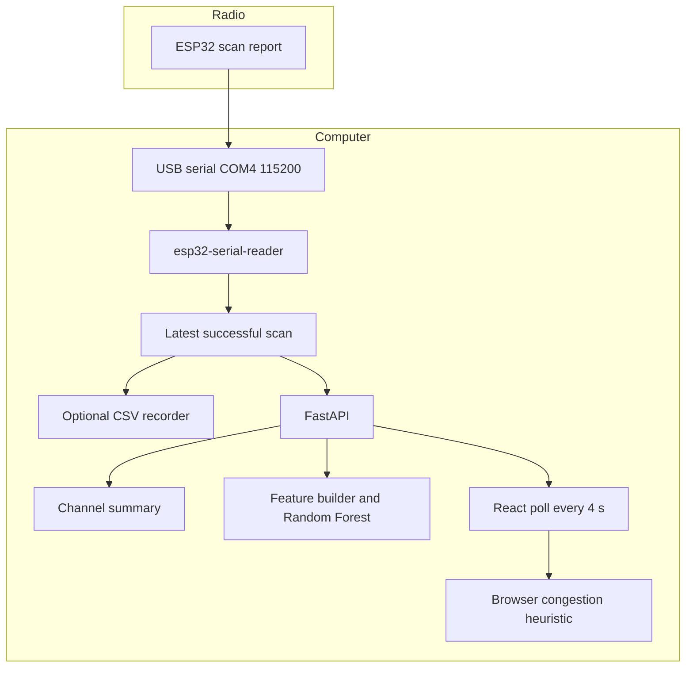

# Technical Documentation

## AI-Powered Wi-Fi Interference Detection and Adaptive Mitigation Platform Using Intelligent Wi-Fi Scanning

**Document role:** Thesis-oriented technical description of the implemented prototype

**Basis:** The AETHER-RF working tree as audited on 10 October 2026

**Companion:** `AETHER_RF_FINAL_TECHNICAL_AUDIT.md`, which records file-level evidence, live API examples, and the test matrix

This document distinguishes three layers. **Implemented results** are present in code or in files read during the audit. **Simulated demonstrations** are the dashboard simulator and the synthetic Random Forest examples. **Proposed future work** includes packet-loss measurement, router control, and any claim of validated interference detection. No external research papers are cited, because this text does not invent a bibliography.

---

## 1. Project overview

The prototype observes 2.4 GHz Wi-Fi networks with an ESP32, transfers each scan to a computer as a line of JSON over USB serial, and presents the measurements on a local web dashboard. The dashboard computes a congestion heuristic and recommends one of the non-overlapping channels 1, 6, or 11. A separate Random Forest classifies the latest fresh scan as LOW, MEDIUM, or HIGH congestion risk. That class imitates a documented rule. It is not a measurement of interference power, packet loss, or throughput.

The computer side is a Python process. One thread owns COM4 at 115200 baud (`backend/serial_reader.py`). FastAPI exposes the latest scan (`backend/main.py`). React polls that API every four seconds (`src/services/esp32Api.ts`). An older Express server on port 3000 remains the simulation host (`server.ts`). The two paths do not share scan history.

The implementation is a final-year demonstration. It is not a controller for a wireless LAN, and it does not configure an access point.

## 2. Problem statement

In the 2.4 GHz band, Wi-Fi channels are 5 MHz apart while a typical transmission occupies about 20 MHz. Access points on the same channel contend with one another. Access points on nearby channels overlap. A site survey that lists only SSIDs does not show which channel is relatively less occupied, and it does not by itself measure how much user traffic is lost.

The engineering problem addressed by this prototype is narrower: given a list of nearby networks with RSSI and channel number, compute an explainable picture of occupancy and overlap, recommend a candidate channel, and show how a classical classifier would label that picture. The prototype does not claim to measure the resulting user experience.

## 3. Aim and objectives

**Aim.** Build a local platform that reads real ESP32 Wi-Fi scans, displays them, scores channel congestion with an explicit heuristic, records the scans, and demonstrates a Random Forest without presenting heuristic labels as ground truth.

**Objectives that the repository meets**

1. Ingest newline-delimited scan JSON from COM4 with a single serial owner.
2. Expose status, observations, channel statistics, and a prediction over HTTP on localhost.
3. Show SSID, BSSID, RSSI, channel, and security type on the existing dashboard.
4. Compute linear-power mean RSSI, overlap weights, a congestion score, and a recommended channel.
5. Keep a simulation mode that cannot silently replace a failed hardware view.
6. Append scans to CSV files when recording is explicitly enabled.
7. Train and load a Random Forest whose limitations are stated in the model metadata and on the prediction card.

**Objectives that are not met, and are not pretended**

- Direct measurement of packet loss, latency, or throughput.
- Automatic change of a router’s channel.
- A classifier trained on independently verified interference labels.
- Proof that the archived sketch is the image currently stored on the ESP32. The sketch matches the serial contract, but the chip was not read back.

## 4. Scope

The radio scope is 2.4 GHz channel numbers 1–14 as accepted by the parser. Feature tables and the dashboard chart use channels 1–13. Channel 14, if reported, overlaps only itself in the overlap function (`spectral_overlap` and `getSpectralOverlapFactor`).

The software scope is one Windows computer, one serial port, one FastAPI process, and one browser session. There is no database and no cloud service in the scanning path.

Out of scope, and marked as such in the interface, are ICMP loss, round-trip time, and throughput (`src/components/FuturePerformanceMetrics.tsx`).

## 5. System requirements

**Hardware, as far as it is evidenced**

- An ESP32 that emits the JSON contract in Section 7. The module name is not stored in the repository.
- A USB serial port that Windows exposes as COM4. The baud rate in code is 115200. The USB-serial chip is not identified by any file in the repository.
- A computer able to run the Python 3.14 virtual environment and Node.js.

**Software that was verified present**

- Python 3.14.8 in `backend/.venv`
- PySerial 3.5, FastAPI 0.143.0, Uvicorn 0.54.0, scikit-learn 1.7.2, pandas 2.3.3, joblib 1.5.2
- Node.js v24.16.0
- React, TypeScript, Vite, Tailwind CSS, and Recharts at the versions declared in `package.json`. The production build log reported Vite 6.4.4.

**Operating constraint**

Only one program may open COM4. The API is started without Uvicorn’s reloader so that a file change cannot spawn a second reader.

## 6. Hardware design

### 6.1 Division of labour

The ESP32 is the only component that can hear Wi-Fi management traffic and report a scan. The PC timestamps the line, checks its shape, and calculates every derived quantity. This split matters scientifically: RSSI in the JSON is a radio report; congestion, overlap, and the forest class are software.

### 6.2 Serial link

`Esp32SerialReader` opens `COM4` at 115200 baud with a one-second read timeout. After the port opens it waits two seconds, then reads lines. A serial or OS error marks the link disconnected, keeps the last successful scan, waits five seconds, and tries again (`serial_reader.py`, `_run` and `_open_and_read`).

The repository does not document whether that two-second wait is there because the module resets when the port opens. The thesis should not assert a reset unless it is measured.

### 6.3 What the scan report contains

A successful line is a JSON object with `scanSuccess` equal to true and a `networks` list. Each network carries `ssid`, `bssid`, `rssi`, `channel`, and a security field. RSSI must be an integer from −120 to 0. Channel must be an integer from 1 to 14. An empty `networks` list is still a successful scan. `scanSuccess: false` does not replace the previous success (`parse_serial_line`).

During the audit, scan 1327 arrived with one network: SSID `Chibuzor`, BSSID `D8:42:F7:19:1B:0A`, RSSI −86 dBm, channel 10, security `SECURED`. The token `SECURED` is not in the WPA name table. The parser keeps compact alphanumeric tokens, which is why the dashboard can show it (`_normalize_security`).

### 6.4 What the hardware does not measure

The platform does not measure packet loss, throughput, latency, or channel power with a spectrum analyser. RSSI is not interference power. An access point at −86 dBm is a weak beacon report, not a reading of the noise floor.

### 6.5 Firmware gap

The serial sketch is archived at `firmware/sketch_oct10b/sketch_oct10b.ino`. It is an unchanged copy of the Arduino sketchbook file of the same name. It opens serial at 115200 baud and prints one JSON object per scan. The ESP32 flash was not read, so this file is the archived source rather than a dump of the chip. `Esp32IntegrationModal.tsx` shows a different Arduino example that POSTs to port 3000. That example is not the archived sketch and is not the working ingest path.

## 7. Software design

### 7.1 Processes

| Process | Port | Role |
|---|---|---|
| `uvicorn main:app` | 127.0.0.1:8000 | Serial owner and hardware API |
| `npm run dev` (`tsx server.ts`) | 3000 | Dashboard and simulation API |
| Browser | — | Heuristic, charts, prediction card |

FastAPI allows browser calls from localhost and 127.0.0.1 on ports 3000 and 5173 only (`LOCAL_ORIGINS` in `main.py`).

### 7.2 Serial reader

The reader is a daemon thread. `get_reader()` builds it once per process and, if recording is enabled, attaches one `ScanRecorder`. HTTP handlers call `snapshot()`, which copies the latest scan under a lock. They do not touch the serial port.

### 7.3 Dashboard state

`App.tsx` stores a simulation snapshot and a hardware snapshot separately. The visible scan is the one for the selected source. ESP32 polling aborts on unmount and ignores a stale response if the user has switched to simulation. The same scan id and timestamp do not increment the cycle counter twice.

### 7.4 Recording

`ScanRecorder` appends CSV. The enable flag is an environment variable read when the process starts. It is not a button in the dashboard. Files are not truncated. A repeated `(scan_id, received_at_utc)` is skipped.

### 7.5 Model service

`congestion_model.load_model` reads `random_forest.joblib` on first use and caches it. Prediction failure becomes an unavailable status. It does not fall back to a made-up class.

## 8. System architecture



The diagram’s important split is inside the computer. Channel summary, forest features, and the browser heuristic are three consumers of the same network list. They are not one shared score.

```text
Serial line accepted
  timestamp assigned in Python
  memory updated
  CSV append only if recording is on and the key is new

Browser poll
  GET /api/observations  -> processRawObservations -> score and recommendation
  GET /api/channels      -> table of counts and linear means, not the chart score
  GET /api/prediction    -> six features -> forest -> LOW / MEDIUM / HIGH or unavailable
```

## 9. Implementation methodology

The visible git history builds a simulator first: an initial platform, a live-scanner refactor, FUTO campus profiles, and a larger simulated device pool (commits through `e2147b9`). The serial reader, FastAPI hardware API, CSV recorder, and Random Forest are present as working-tree files and were not part of those commits at the time of the audit. The methodology below follows the code’s dependencies. It should be read as the construction order of the prototype, not as a dated laboratory log.

1. Define a dashboard contract for a scan batch: observations, derived metrics, and a source flag (`src/types/wifi.ts`).
2. Implement the congestion mathematics once, and use them for both simulation and, later, hardware observations (`derivedParameters.ts`).
3. Add a serial parser that rejects bad lines and preserves the last good scan.
4. Serve that scan through FastAPI without opening the port per request.
5. Map the API onto the existing React contract and keep simulation on a separate snapshot.
6. Record successful scans at the reader, not at the HTTP layer, so polling cannot duplicate rows.
7. Add optional human-readable session labels without replacing the UUID.
8. Train a forest only after counting real labels, and keep synthetic rows in a separate file.
9. Show the forest in a card that names it as a heuristic-trained demonstration.

Each step reuses the previous data contract instead of adding a second dashboard.

## 10. Data acquisition

### 10.1 Live acquisition

When the API process starts, the reader connects and waits for lines. Each accepted line becomes the current scan. The dashboard’s four-second poll copies it out. If no new line arrives, the same scan id remains current and the UI does not count it as a new cycle.

The timestamp is UTC at receipt. Scan duration is null for hardware because the reader does not parse a duration field.

### 10.2 Recorded corpus

At audit time the recording directory held:

- 2 session rows
- 12 scan rows, all belonging to session `6c570c46f41c411383b2103ec81da26c`
- 22 access-point rows
- 156 feature rows, which is 12 scans times 13 channels

Network counts on those scans were 1, 2, or 3. The second session, named `home_baseline_01`, has labels `residential_indoor` and `passive_baseline` and **no scan rows**. A named session in `sessions.csv` is not evidence that scans were captured. Labels are not used to assign congestion classes.

Recording is gitignored under `backend/data/` because SSIDs and BSSIDs can identify a household. Export with `dataset_recorder.py export --pseudonymize` produces a separate copy and does not copy the salt.

### 10.3 Simulation as a data source

Simulation generates networks in `simulator.ts` and `wifiDataSource.ts`, including names used for a campus-style demonstration. Those scans are tagged `SIMULATED`. They are not written by the ESP32 recorder. They must not be described as field measurements.

## 11. Signal and channel analysis

### 11.1 RSSI

The stored RSSI is the integer from the scan. Interpretation in this project is ordinal and local: a less negative number is a stronger reported signal. No calibration offset is applied.

### 11.2 Mean power

Decibel values are converted to a power ratio, averaged, and converted back:

`mean_dBm = 10 * log10( mean( 10^(r_i / 10) ) )`

rounded to 0.1 dB (`linear_power_mean_dbm`, `calculateAverageRssi`).

For −40 dBm and −50 dBm the linear-power mean is −42.6 dBm, not the arithmetic mean −45 dBm.

Empty channels are null on `GET /api/channels`. The browser score uses −100 dBm as an internal empty-channel sentinel so that a later formula has a number. That sentinel is not displayed as a measured RSSI in the channel API.

### 11.3 Occupancy and overlap

Occupancy is a count of reported access points per channel. Overlap is a fixed weight of the channel-number difference:

| Difference | 0 | 1 | 2 | 3 | 4 | ≥ 5 |
|---|---|---|---|---|---|---|
| Weight | 1.00 | 0.82 | 0.58 | 0.32 | 0.12 | 0 |

`overlap_weighted_ap_count` for a channel is the sum of other channels’ counts times these weights (`_feature_rows`). One access point on channel 6 contributes 0.82 to channel 7 and 0 to channel 6 itself.

These weights are an engineering mask chosen in software. They are not a measured spectrum mask from this hardware.

### 11.4 Dashboard congestion heuristic

For each channel, `processRawObservations` builds a co-channel term from density `min(1, count/6)` and a normalised mean RSSI between −100 dBm and −30 dBm, then an adjacent term:

`congestion = 0.70 * coChannel + 0.30 * aci`

with both parts clamped to 1. Severity is HIGH, MEDIUM, LOW, or NORMAL from the peak score and the number of observations, using the thresholds 0.75, 0.50, and 0.25, or observation counts 18, 10, and 4 (`derivedParameters.ts`). This is a heuristic. The hardware view’s rationale text says it is not a trained model.

A single access point at −80 dBm on channel 6 produces a congestion score near 0.16 and severity NORMAL under this rule.

## 12. Machine-learning methodology

### 12.1 Question the model is allowed to answer

The model answers: which of LOW, MEDIUM, or HIGH would the project’s label rule assign, as approximated by a forest. It does not answer: how much interference a user experienced.

### 12.2 Features

The six inputs are computed by `scan_features_from_channel_rows`:

1. total access-point count on channels 1–13
2. number of those channels that are non-empty
3. maximum count on one channel
4. linear-power mean RSSI, or −100 if none
5. strongest RSSI, or −100 if none
6. maximum overlap-weighted count

Training rows from the CSV and live rows from the API use this same function family (`channel_feature_rows` is the live producer of the thirteen channel rows).

### 12.3 Labels

`heuristic_label` computes

`risk = 0.45 * min(N/10, 1) + 0.20 * min(occupied/8, 1) + 0.20 * strength + 0.15 * min(maxOverlap/4, 1)`

where `strength` is 0 with no access points and otherwise `(strongest_dBm + 100) / 70`, clamped to 0..1.

LOW is below 0.35, MEDIUM is below 0.62, and HIGH is 0.62 or above. Session names are not inputs. The twelve real scans all fall in LOW.

The same one-access-point illustration used above is LOW under this rule (risk about 0.14 when the strongest RSSI is −86 dBm and the overlap term is 0.82). Dashboard severity can still be NORMAL. The two displays are not required to match, and a thesis should not force them into one scale.

### 12.4 Why synthetic rows exist

A three-class classifier cannot be demonstrated from a single LOW class. `train_model.py` invents access-point placements with a fixed random stream, converts them with the real feature function, and keeps the row only if the rule emits the desired class. It keeps 48 of each class. Every saved synthetic row has `example_origin = synthetic_demonstration`. They are not ESP32 captures and they are not stored in `backend/data/recordings/`.

### 12.5 Fitting and evaluation

The 144 synthetic rows are split 70/30, stratified, seed 42. The 12 real LOW rows are added only to training. The fit uses 80 trees, depth 6, balanced class weight, and seed 42. The training table has 112 rows. The holdout has 15 LOW, 15 MEDIUM, and 14 HIGH.

On that holdout the accuracy, precision, recall, and F1-score are all 1.00. The confusion matrix is diagonal: 15, 15, and 14. `model_metadata.json` sets `reliableInterferenceEvaluation` to false and `labelsAreMeasuredInterference` to false. The perfect score is expected when examples are retained only after the label rule has already separated them. It measures imitation of the heuristic on synthetic vectors.

No session-separated evaluation of real interference is possible. There is one real scan session and one real class.

### 12.6 Persistence and inference

The estimator and the feature-name tuple are stored in `backend/data/model/random_forest.joblib`. The API loads that file once per process. A poll does not retrain. If the file is missing, or the scan is not fresh, the response status is `unavailable` and `predictedClass` is null.

The live audit read returned LOW for scan 1327, the same scan that contained one access point at −86 dBm.

## 13. Adaptive mitigation strategy

Mitigation in this prototype is a recommendation, not an action.

`processRawObservations` selects the channel with the lowest congestion score among {1, 6, 11}. Those three are the usual non-overlapping 20 MHz set in this band. The comparison is only of the heuristic scores. If scores tie, the earlier channel in the list 1, 6, 11 remains. The worst channel, shown separately, is the highest score on channels 1–13.

The dashboard text states that the recommendation is a deterministic heuristic from occupancy, RSSI, and overlap, and that it does not control the router (`esp32Api.ts`, appended rationale). There is no HTTP call to an access point, no SSH session, and no controller in the repository.

“Adaptive” in the project title is therefore prospective. The implemented behaviour is: recompute the recommendation whenever a new scan is displayed. It does not close a control loop.

## 14. Integration

Integration is the mapping in `esp32Api.ts`. A hardware network becomes a `RawWiFiObservation` with a stable id from the BSSID and scan id, source `ESP32_HARDWARE`, and a null scan duration. `processRawObservations` then produces the same `DerivedAnalysis` structure the simulator already used.

The prediction is a parallel fetch. Its failure does not, by itself, discard observations. The card in `AiPredictionCard.tsx` is hidden from simulation in the sense that simulation forces the class to “Unavailable” and says the forest is not applied. The heuristic cards remain.

Connection labels are separate from interference severity: Connected/Fresh, Connected/Stale, Disconnected, Waiting for first scan, and API unavailable (`ESP32_LINK_LABEL`).

## 15. Testing and results

### 15.1 Checks during the documentation audit

The API process was already running. It was not restarted.

| Check | Result |
|---|---|
| `GET /api/status` | HTTP 200, connected, COM4, 115200, fresh |
| `GET /api/observations` | Scan 1327, one network, RSSI −86, channel 10, security SECURED |
| `GET /api/channels` | 13 channels, method `linear_power`, empty RSSI null |
| `GET /api/prediction` | LOW, model ready, same scan id and timestamp |
| CSV counts | 12 scans, 22 access points, 156 feature rows, 2 sessions |
| Synthetic file | 144 rows, 48 per class, origin `synthetic_demonstration` |
| Real label file | 12 rows, all LOW |
| Firmware archive | `firmware/sketch_oct10b/sketch_oct10b.ino`, copied from the local sketchbook. Flash contents were not read back. |

### 15.2 Checks earlier on 10 October 2026

These were run while the prototype was being built. They were not all repeated for this chapter.

- Dataset script: duplicate suppression, zero-network retention, disabled recording, restart append, pseudonym export, and a legacy session migration on a fixture. The script reported that the live recording bytes were unchanged at the end of that run.
- A hardware recording window stored 12 scans once. Repeated polls of one scan did not add rows. A later process with recording disabled served newer scan ids while the CSV stayed at 12 scans.
- `tsc --noEmit` exited 0.
- `npm run build` exited 0, with a chunk-size warning.
- A browser pass showed the Random Forest card as LOW on ESP32 Live, showed the heuristic recommendation, and showed simulator network names when Simulation was selected, with the forest marked not applied.

### 15.3 Not tested

- Removing the USB cable and confirming the disconnected screen.
- A second physical environment that would produce a real MEDIUM or HIGH label.
- The archived sketch against a read-back of the ESP32 flash, or against a unit-test harness.
- Whether the GitHub remote contains the serial and model files. Local git history does not.

## 16. Discussion

The prototype succeeds at the data-path problem: a real scan report appears in a browser, with RSSI and channel, within a four-second poll, without inventing networks when the API fails. The congestion view is transparent enough to defend, because every weight is in `derivedParameters.ts`. The recommendation is honest about being advisory.

The machine-learning chapter must be defended as a software demonstration. The field corpus is twelve scans from one session, all heuristically LOW. The forest’s perfect holdout score is agreement with a rule that was used to accept or reject synthetic draws. That is a useful teaching result about leakage and label circularity. It is not a detection rate.

A second design issue is documentary drift. `docs/ARCHITECTURE.md` and the integration modal still describe HTTP POST ingestion and a future classifier. The code that actually runs is serial ingestion and a demonstration forest. A thesis that quotes the modal as the firmware will be wrong. The serial contract is the one in `parse_serial_line`.

A third issue is the unused session `home_baseline_01`. Metadata was written and no scans were. Session names must not be narrated as completed experiments unless scan rows exist.

## 17. Limitations

1. The serial sketch is archived, but board revision, USB-serial chip, and proof that this file is the flashed image are not in the repository.
2. RSSI is uncalibrated against an instrument.
3. Overlap weights are a fixed table, not a measured emission mask.
4. Both “congestion” displays are heuristics, and they use different formulas.
5. The recorded corpus has one session and one heuristic class.
6. Synthetic examples are not physical measurements.
7. The forest is not validated for real-world interference detection.
8. There is no closed-loop mitigation.
9. Packet loss, latency, and throughput are unimplemented.
10. USB unplug behaviour was not observed in a hardware test.
11. One COM4 owner is an operational limit. A second terminal will break the demo.
12. Raw recordings contain identifiers and should not be published as-is.

## 18. Conclusion

A local ESP32-to-browser path was implemented: USB serial JSON, one Python reader, a localhost FastAPI service, and the existing React dashboard. Real scans are displayed with RSSI, channel, and security type. A documented heuristic scores channels and recommends one of channels 1, 6, or 11 without controlling a router. Scans can be recorded to CSV, separate from derived features and separate from labels.

A Random Forest is integrated as a demonstration. It uses six features defined by the same channel-feature code as the recorder. It was necessary to add 144 clearly marked synthetic examples because the 12 real scans are all LOW. The holdout accuracy of 1.00 is agreement with that heuristic on synthetic data. The platform is suitable for a one-day academic demonstration if those limits are stated in the same words the interface already uses.

## 19. Recommendations for future work

These items are not implemented.

1. Archive the flashed sketch and record the board and USB-serial chip in the thesis appendix.
2. Remove or relabel the HTTP POST sketch and `docs/ARCHITECTURE.md` so they cannot be mistaken for the working design.
3. Collect scans in more than one environment, with a written placement log, before training any classifier that is claimed to detect interference.
4. Keep labels that come from an external observation, such as a controlled interferer or a throughput test, in a file that is not a function of the same features the model reads.
5. If packet loss, latency, or throughput are added, store them as their own measurements and show the existing null cards only until those measurements exist.
6. Treat channel changes on a router as a separate, explicitly authorised experiment. Do not imply that the current recommendation performs that change.
7. Publish pseudonymized exports rather than raw BSSIDs.

---

## Appendix A. Code index

| Claim | Location |
|---|---|
| COM4, 115200, one reader thread | `backend/serial_reader.py` |
| JSON acceptance rules | `parse_serial_line`, `_parse_network` |
| Freshness of 30 seconds | `FRESH_WINDOW_SECONDS` in `backend/main.py` |
| Prediction unavailable states | `build_prediction` |
| Linear-power mean and overlap table | `backend/dataset_recorder.py` |
| Six features and label thresholds | `backend/congestion_model.py` |
| Forest hyperparameters and split | `backend/train_model.py` |
| Holdout numbers | `backend/data/model/model_metadata.json` |
| Dashboard congestion and recommendation | `processRawObservations` in `src/services/derivedParameters.ts` |
| Four-second poll | `ESP32_POLL_INTERVAL_MS` |
| Prediction card wording | `src/components/AiPredictionCard.tsx` |
| Unimplemented performance metrics | `src/components/FuturePerformanceMetrics.tsx` |
| Illustrative, non-authoritative sketch | `src/components/Esp32IntegrationModal.tsx` |
| Simulation server | `server.ts` |

## Appendix B. Start procedure

Stop any process already using COM4. Then:

```powershell
cd C:\Users\user\Desktop\AETHER-RF\backend
.\.venv\Scripts\python.exe -m uvicorn main:app --host 127.0.0.1 --port 8000
```

In a second terminal:

```powershell
cd C:\Users\user\Desktop\AETHER-RF
npm run dev
```

Open the dashboard and select ESP32 Live. Recording stays off unless `AETHER_RECORD_SCANS` is set to `1` before the API starts. Training, if the model file is absent, is a separate command and was not part of serving scans:

```powershell
cd C:\Users\user\Desktop\AETHER-RF\backend
.\.venv\Scripts\python.exe train_model.py
```

That command reads the recordings and writes only under `backend/data/model/`.
